###  Basic database project

Pour cloner le project:
`git clone --recursive https://github.com/chemin.vers.repos.git`

Si jamais vous ne voyez pas zig.exe dans Tools, FoundryTools_windowsx64, faite:
`.\setup.bat`

Pour compiler le project:
`ctrl+shift+b`

Pour debugger le project:
`F5`

```mermaid
erDiagram
Customer{
    CustomerID INTEGER PRIMARY KEY
    name TEXT
    money_left INT
}
Character{
  CharacterID INTEGER PRIMARY KEY
  name TEXT
  dialog TEXT
}
Object{
  ObjectID INTEGER PRIMARY KEY
  name TEXT
  cost INT
}
Product{
   ProductID INTEGER PRIMARY KEY
   name TEXT
}
Order{
   OrderID INTEGER PRIMARY KEY
   Exportation_date INT
   Deadline INT
}
Category{
   CategoryID INTEGER PRIMARY KEY
   name TEXT
}
    Order ||--o{ Product : has
    Object ||--o{ Customer : has
    Character ||--o{ Customer : has
    Product ||--o{ Object : has
    Category ||--o{ Product : has

```

